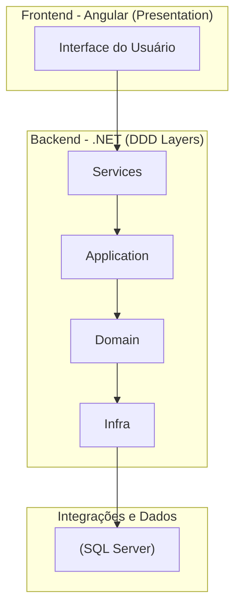

# 📌 Sistema de Seguros (Angular + .NET + EF + SQL Server)

Projeto desenvolvido em **.NET 8** com **Entity Framework Core** e **SQL Server** no backend, e **Angular 20** no frontend.  
A aplicação expõe uma API documentada com **Swagger**, possui testes unitários tanto no backend quanto no frontend, e utiliza **SASS** para estilização.  

---

## 🚀 Sobre o Projeto
Este projeto foi desenvolvido a partir das especificações presentes no documento **“Exame_Desenvolvedor_DotNet.pdf”**, que detalha os requisitos técnicos e funcionais do sistema.  

O objetivo principal é implementar um **sistema de controle de Seguros**, seguindo o **Domain-Driven Design (DDD)**.  
O backend está organizado nas camadas: **Services, Application, Domain, Infra**, enquanto o frontend é implementado na camada **Presentation (Angular)**.  

Funcionalidades principais (até o momento):
- Consulta, Adição, Alteração e remoção de Seguros  
- Consulta, Adição, Alteração e remoção de Segurados  
- Consulta, Adição, Alteração e remoção de Veículos
- Extração de relatório no formato JSON  

---

## 📖 Documentação Oficial
O documento completo com as especificações do projeto pode ser encontrado em:  
[`Documentação/Exame_Desenvolvedor_DotNet.pdf`](./Documentação/Exame_Desenvolvedor_DotNet.pdf)  

---

## 🛠 Tecnologias Utilizadas
### Backend
- **.NET 8**  
- **Entity Framework Core** (Code First)  
- **SQL Server 2019+**  
- **Swagger / Swashbuckle** (documentação da API)  
- **Docker** (planejado para containerização)
- **XUnit** (testes unitários)  

### Frontend
- **Angular 20**  
- **SASS** (pré-processador de estilos)  
- **Karma + Jasmine** (testes unitários)

---

## 🏗 Arquitetura do Sistema

O projeto segue os princípios do **Domain-Driven Design (DDD)**, com separação clara de responsabilidades entre camadas de **Frontend** e **Backend**, além de integrações com banco de dados e APIs externas.  

### 🔹 Camadas do Sistema
- **Frontend (Presentation)** → Aplicação Angular responsável pela interface com o usuário.  
- **Backend**  
  - **Services** → Camada de orquestração e lógica de negócios de alto nível.  
  - **Application** → Casos de uso, coordena a execução das regras do domínio.  
  - **Domain** → Entidades e regras de negócio puras (núcleo do sistema).  
  - **Infra** → Implementações de persistência, repositórios e integrações externas.  
- **Acessos a Dados**  
  - **SQL Server** → Persistência dos dados do sistema.  
 ---
 <!--    - **APIs Externas (mockadas via JSONServer)** → Simulação de integrações externas.   -->
### 🔹 Diagrama de Arquitetura


---
<!--JSON["APIs Externas (JSONServer)"]-->
<!-- Infra --> JSON -->
## ⚙️ Configuração e Execução Inicial

O projeto inclui um arquivo **`Setup.bat`** na raiz que automatiza todo o processo inicial no Windows.  
Basta **dar um duplo clique** no arquivo e ele fará:

- Restaurar pacotes NuGet do backend (`dotnet restore`)  
- Instalar dependências NPM do Angular (`npm install`)  
- Subir containers com Docker Compose (`docker-compose up -d --build`)  
- Aguardar o SQL Server ficar disponível  
- Aplicar as migrations do Entity Framework (`dotnet ef database update`)  

Ao final, a aplicação estará pronta para uso.  

---

### 🔹 Executando Manualmente (Linux / Mac / Windows)
Caso esteja usando outro sistema operacional ou queira rodar manualmente, você pode executar os códigos, sempre partindo do diretório raiz da aplicação:

1. **Restaurar dependências .NET**  
   ```bash
   dotnet restore ExamePratico.Services/ExamePratico.Services.csproj
   ```
   
2. **Instalar dependências NPM do Angular**
   ```bash
   cd Frontend
   npm install
   cd ..
   ```

3. **Subir containers com Docker Compose**
   ```bash
   docker-compose up -d --build
   ```
   
4. **Aguardar SQL Server ficar disponível**

- Verifique se o container do SQL Server está rodando e aceitando conexões na porta 1433.

5. **Aplicar migrations do Entity Framework**
   ```bash
   dotnet ef database update --startup-project ExamePratico.Services/ExamePratico.Services.csproj --project ExamePratico.Infra.Data/ExamePratico.Infra.Data.csproj
   ```
   
---
### 🔹 Acessando a Aplicação

- Backend (API): https://localhost:7215/swagger

- Frontend (Angular): http://localhost:54300/

---
<!-- ### 🔹  Testes

- Backend (.NET):
   ```bash
   dotnet test
   ```

- Frontend (Karma + Jasmine):
   ```bash
   cd Frontend
   ng test
   ```
   
--- -->
## 📌 Possíveis Erros e Soluções

- Erro de conexão com SQL Server

	- Confirme se o servidor está rodando (localhost,1433).

	- Verifique login e senha (sa / Senha@123).

	- Ative conexões TCP/IP no SQL Server Configuration Manager.

- Erro ao rodar migrations

	- Adicione ferramentas do EF Core:
	```bash
   dotnet add package Microsoft.EntityFrameworkCore.Tools
   ```

- Execute os comandos via CLI ou Package Manager Console.
   ```bash
   dotnet add package Microsoft.EntityFrameworkCore.Tools
   ```
- Refazer migrations e atualizar banco
Caso seja necessário recriar a migration e atualizar o banco de dados, execute os seguintes comandos na raiz do projeto:

   1 - Remover a última migration (ou todas, se necessário)
   ```bash
   dotnet ef migrations remove \
   --project ExamePratico.Infra.Data/ExamePratico.Infra.Data.csproj \
   --startup-project ExamePratico.Services/ExamePratico.Services.csproj
   ```
   
   2 - Criar nova migration
   ```bash
   dotnet ef migrations add InitialCreate \
   --startup-project ExamePratico.Services/ExamePratico.Services.csproj \
   --project ExamePratico.Infra.Data/ExamePratico.Infra.Data.csproj
   ```
   
   3 - Atualizar o banco de dados   
   ```bash
   dotnet ef database update \
   --project ExamePratico.Infra.Data/ExamePratico.Infra.Data.csproj \
   --startup-project ExamePratico.Services/ExamePratico.Services.csproj
   ```

## 👨‍💻 Autor

Jonas Sene Torres – [LinkedIn](https://www.linkedin.com/in/jonas-sene-torres/) | [GitHub](https://github.com/JonasSeneTorres)

## 📄 Licença


Este projeto está sob a licença [MIT](https://opensource.org/licenses/MIT).

